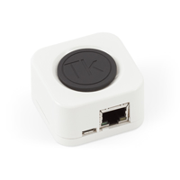

# TheKeys Binding

This is the binding for [TheKeys Smart Lock](https://www.the-keys.eu/fr/produits/8-serrure-connectee.html).  
This binding allows you to integrate, view, control and configure TheKeys Gateway, TheKeys Smart Lock.




## TODO

* Upload icon to : https://github.com/openhab/openhab-docs/tree/main/images/addons
* Add DiscoveryService

## Supported Things

_Please describe the different supported things / devices including their ThingTypeUID within this section._
_Which different types are supported, which models were tested etc.?_
_Note that it is planned to generate some part of this based on the XML files within ```src/main/resources/OH-INF/thing``` of your binding._

- `bridge`: Short description of the Bridge, if any
- `sample`: Short description of the Thing with the ThingTypeUID `sample`

## Discovery

Discovery TODO

## Thing Configuration

_Describe what is needed to manually configure a thing, either through the UI or via a thing-file._
_This should be mainly about its mandatory and optional configuration parameters._


### `gateway` Bridge Thing Configuration

| Name            | Type    | Description                           | Default | Required | Advanced |
|-----------------|---------|---------------------------------------|---------|----------|----------|
| hostname        | text    | Hostname or IP address of the device  | N/A     | yes      | no       |
| code            | text    | The gateway access code               | N/A     | yes      | no       |
| refreshInterval | integer | Interval the device is polled in sec. | 30      | yes      | no       |

TODO : HOW TO FIND GATEWAY HOSTNAME
TODO : HOW TO FIND GATEWAY CODE

### Supported Channels

| Channel       | Type   | Read/Write | Description                                 |
|---------------|--------|------------|---------------------------------------------|
| status        | String | R          | Status of the gateway                       |
| version       | Number | R          | Firmware version                            |

### `smartlock` Thing Configuration

| Name            | Type    | Description                           | Default | Required | Advanced |
|-----------------|---------|---------------------------------------|---------|----------|----------|
| lockId          | integer | Identifier of the smartlock           | N/A     | yes      | no       |

### Supported Channels

| Channel       | Type   | Read/Write | Description                                 |
|---------------|--------|------------|---------------------------------------------|
| status        | String | R          | Status of the smart lock                    |
| batteryLevel  | Number | R          | Current battery level                       |
| lowBattery    | Switch | R          | Low battery warning                         |
| rssi          | Number | R          | Bluetooth Signal strength with the gateway  |
| position      | Number | R          | Position of the lock                        |
| version       | Number | R          | Firmware version                            |
| lastSync      | Switch | R          | Last sync with the lock                     |
| lock          | Switch | RW         | Switch to lock and unlock the lock          |

## Full Example


A manual setup through files could look like this:

### things/thekeys-gateway.things

```
Bridge thekeys:gateway:tk-gateway [ hostname="192.168.1.50", code="@th€c0de", refreshInterval="5" ] {
    Thing smartlock tk-smartlock [ lockId="1234" ]
}
```